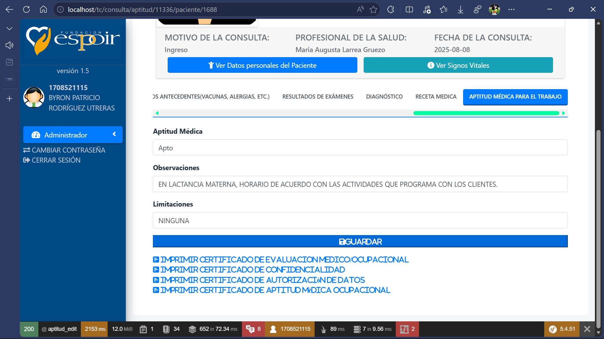
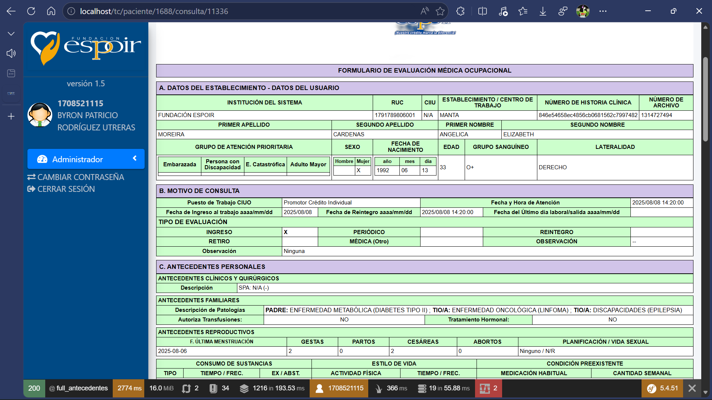
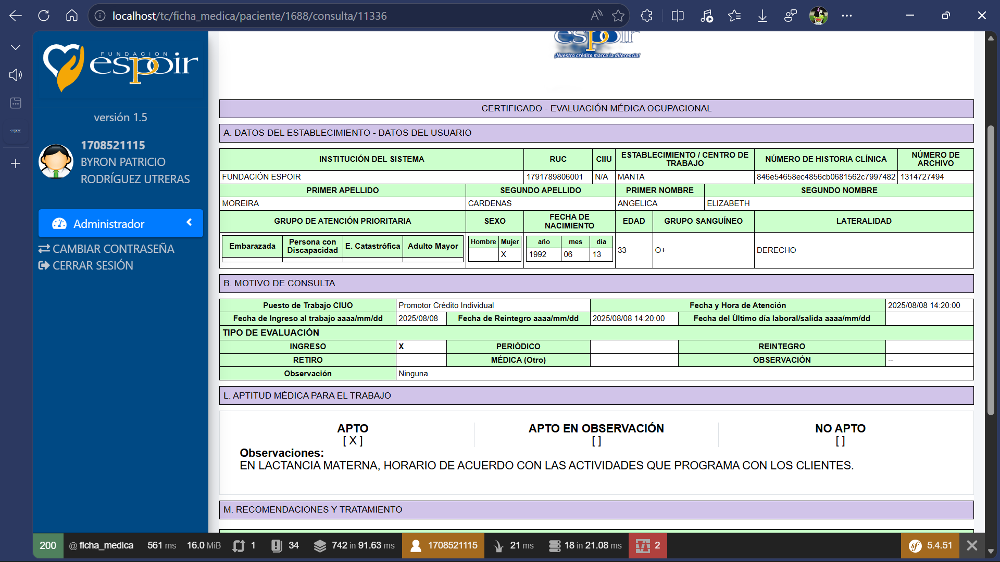
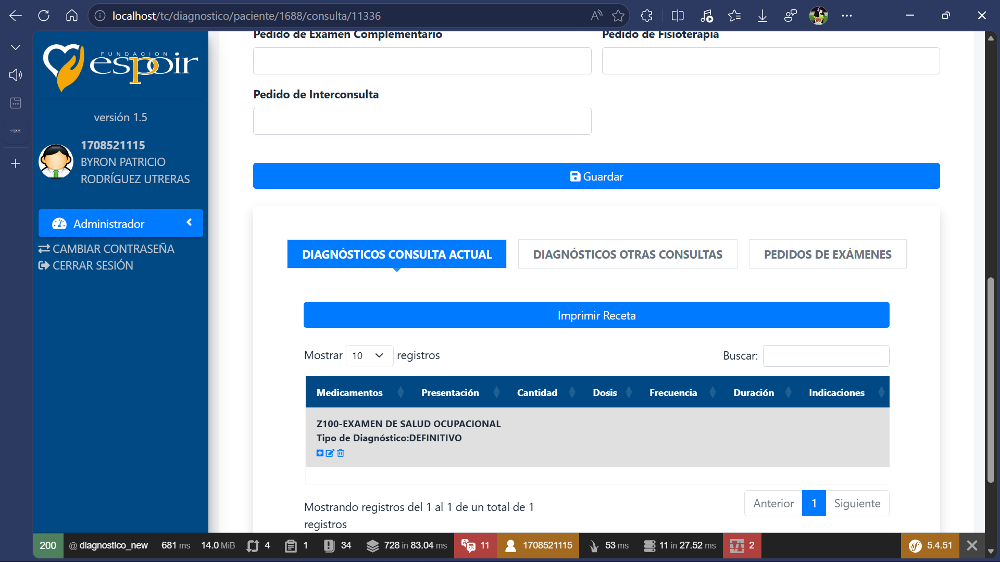

"Sistema de Evaluacion Medica Ocupacional" 
Caracterisitcas:
- Registro de paciente
- Registros Medicos
- Ficha Medicina Ocupacional
- Certificado de Aptitud Medica Ocupacional.
- Certificado Medico
- Diagnostico y tratamiento.

